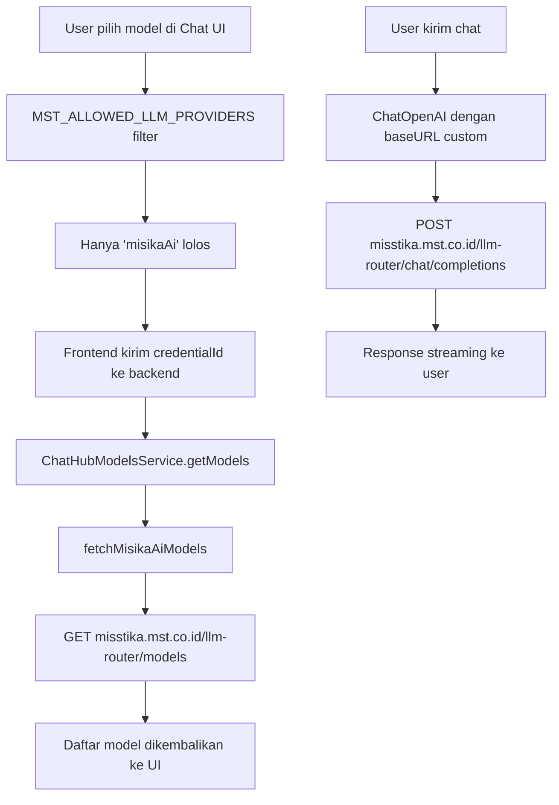

# Phase 1 — Type Safety, DTO, Mistika-AI Provider & UI Cleanup

> Dokumen ini mencatat semua perubahan yang dilakukan pada sesi pengerjaan lanjutan Phase 1.
> Terakhir diupdate: 2026-06-18

---

## Daftar Perubahan

| # | Kategori | File | Jenis |
|---|----------|------|-------|
| 1 | Type Safety | `@n8n/api-types/src/schemas/user.schema.ts` | Dimodifikasi |
| 2 | DTO | `@n8n/api-types/src/dto/user/toggle-user-disabled-request.dto.ts` | **File baru** |
| 3 | DTO Export | `@n8n/api-types/src/dto/index.ts` | Dimodifikasi |
| 4 | Controller | `packages/cli/src/controllers/users.controller.ts` | Dimodifikasi |
| 5 | ChatStarter UI | `editor-ui/src/features/ai/chatHub/components/ChatStarter.vue` | Dimodifikasi |
| 6 | Dockerfile | `deploy/phase-0/Dockerfile` | Dimodifikasi |
| 7 | Credential | `@n8n/nodes-langchain/credentials/MisikaAiApi.credentials.ts` | **File baru** |
| 8 | LangChain Node | `@n8n/nodes-langchain/nodes/llms/LmChatMisikaAi/LmChatMisikaAi.node.ts` | **File baru** |
| 9 | Node Registry | `@n8n/nodes-langchain/package.json` | Dimodifikasi |
| 10 | API Types | `@n8n/api-types/src/chat-hub.ts` | Dimodifikasi |
| 11 | Backend Constants | `packages/cli/src/modules/chat-hub/chat-hub.constants.ts` | Dimodifikasi |
| 12 | Backend Service | `packages/cli/src/modules/chat-hub/chat-hub.models.service.ts` | Dimodifikasi |
| 13 | Frontend Constants | `editor-ui/src/features/ai/chatHub/constants.ts` | Dimodifikasi |
| 14 | Model Selector | `editor-ui/src/features/ai/chatHub/model-selector.utils.ts` | Dimodifikasi |
| 15 | Providers Table | `editor-ui/src/features/ai/chatHub/components/ChatProvidersTable.vue` | Dimodifikasi |
| 16 | Settings Users | `editor-ui/src/features/settings/users/views/SettingsUsersView.vue` | Dimodifikasi |

---

## 1. Type Safety — Field `disabled` di Frontend

**File:** `packages/@n8n/api-types/src/schemas/user.schema.ts`

**Masalah:** Field `disabled` yang ada di backend `User` entity tidak tersedia di tipe frontend `IUser`, sehingga komponen frontend tidak bisa membaca status disabled user.

**Perubahan:**

```typescript
// SEBELUM
export const userDetailSchema = userBaseSchema.extend({
    firstName: z.string().optional(),
    lastName: z.string().optional(),
    // ...
});

// SESUDAH
export const userDetailSchema = userBaseSchema.extend({
    firstName: z.string().optional(),
    lastName: z.string().optional(),
    // ...
    disabled: z.boolean().optional(),  // ← ditambahkan
});
```

**Efek:** Rantai tipe `IUser → IUserResponse → User` kini menyertakan `disabled?: boolean` sehingga frontend bisa menggunakannya.

---

## 2. DTO Baru — `ToggleUserDisabledRequestDto`

**File baru:** `packages/@n8n/api-types/src/dto/user/toggle-user-disabled-request.dto.ts`

**Masalah:** Endpoint `PATCH /users/:id/disabled` sebelumnya menggunakan inline type `@Body { disabled: boolean }` — tidak mengikuti pola DTO yang dipakai seluruh codebase n8n.

**File baru:**

```typescript
import { z } from 'zod';
import { Z } from '../../zod-class';

export class ToggleUserDisabledRequestDto extends Z.class({
    disabled: z.boolean(),
}) {}
```

**File diupdate:** `packages/@n8n/api-types/src/dto/index.ts`

```typescript
// Ditambahkan:
export { ToggleUserDisabledRequestDto } from './user/toggle-user-disabled-request.dto';
```

---

## 3. Controller — Pakai DTO yang Benar

**File:** `packages/cli/src/controllers/users.controller.ts`

**Perubahan:**

```typescript
// SEBELUM
async toggleUserDisabled(
    req: AuthenticatedRequest,
    _res: Response,
    @Param('id') id: string,
    @Body payload: { disabled: boolean },   // ← inline type
)

// SESUDAH
import { ..., ToggleUserDisabledRequestDto } from '@n8n/api-types';

async toggleUserDisabled(
    req: AuthenticatedRequest,
    _res: Response,
    @Param('id') id: string,
    @Body payload: ToggleUserDisabledRequestDto,   // ← DTO proper
)
```

---

## 4. ChatStarter.vue — Cleanup Halaman `/home/chat`

**File:** `packages/frontend/editor-ui/src/features/ai/chatHub/components/ChatStarter.vue`

**Masalah:** Halaman `/home/chat` menampilkan 3 card (Workflow agents, Personal agents, Base models) dan tombol "Invite chat users" yang tidak diinginkan.

**Yang dihapus:**
- Card "Workflow agents"
- Card "Personal agents"
- Card "Base models"
- Tombol "Invite chat users"

**Yang tersisa:**
- Logo MST (`mst-logo.svg`)
- Sapaan `Selamat datang, {nama pengguna}!`
- Tombol "Start new chat"

**Struktur template setelah perubahan:**

```vue
<template>
    <Transition name="welcome-fade" mode="out-in">
        <div v-if="showWelcomeScreen" :class="$style.welcomeContent">
            
            <N8nHeading tag="h2" bold size="xlarge">
                Selamat datang<span v-if="currentUserName">, {{ currentUserName }}</span>!
            </N8nHeading>
            <N8nButton variant="solid" size="medium" icon="plus"
                data-test-id="welcome-start-new-chat" @click="handleStartNewChat">
                {{ i18n.baseText('chatHub.welcome.button.startNewChat') }}
            </N8nButton>
        </div>
    </Transition>
</template>
```

---

## 5. Dockerfile — Fix Build Error `distutils`

**File:** `deploy/phase-0/Dockerfile`

**Masalah:** Build gagal dengan error:
```
ModuleNotFoundError: No module named 'distutils'
```

**Penyebab:** Python 3.12+ menghapus modul `distutils` dari standard library. `node-gyp@8.x` (yang digunakan untuk compile native addon `isolated-vm`) masih mengimport `from distutils.version import StrictVersion`.

**Perubahan di Stage 1 (builder) dan Stage 2 (native-builder):**

```dockerfile
# SEBELUM
RUN apk add --no-cache python3 make g++ git

# SESUDAH
RUN apk add --no-cache python3 py3-setuptools make g++ git
# py3-setuptools menyediakan compatibility shim 'distutils' untuk Python 3.12+
```

`py3-setuptools` menyediakan `distutils` sebagai shim kompatibilitas sehingga `node-gyp` bisa berjalan di Alpine Linux dengan Python 3.12+.

---

## 6. Mistika-AI — Credential Type Baru

**File baru:** `packages/@n8n/nodes-langchain/credentials/MisikaAiApi.credentials.ts`

Credential untuk terhubung ke layanan Mistika-AI internal (`misstika.mst.co.id`).

```typescript
export class MisikaAiApi implements ICredentialType {
    name = 'misikaAiApi';
    displayName = 'Mistika-AI';

    properties = [
        {
            displayName: 'API Key',
            name: 'apiKey',          // digunakan sebagai Bearer token
            type: 'string',
            typeOptions: { password: true },
            required: true,
            default: '',
        },
        {
            displayName: 'Base URL',
            name: 'url',
            type: 'string',
            required: true,
            default: 'https://misstika.mst.co.id/llm-router',
        },
    ];

    authenticate = {
        type: 'generic',
        properties: {
            headers: { Authorization: '=Bearer {{$credentials.apiKey}}' },
        },
    };

    test = {
        request: {
            baseURL: '={{ $credentials.url }}',
            url: '/models',
            method: 'GET',
        },
    };
}
```

---

## 7. Mistika-AI — LangChain Node Baru

**File baru:** `packages/@n8n/nodes-langchain/nodes/llms/LmChatMisikaAi/LmChatMisikaAi.node.ts`

Node LangChain yang menghubungkan n8n workflow ke Mistika-AI. Menggunakan `ChatOpenAI` dari `@langchain/openai` dengan `baseURL` custom (pola yang sama dengan OpenRouter).

```
Pola: ChatOpenAI + custom baseURL
      ↳ Kompatibel dengan OpenAI-compatible API
      ↳ Endpoint: https://misstika.mst.co.id/llm-router
```

**Fitur node:**
- Model selector via `GET /models` (OpenAI-compatible response `{ data: [{ id }] }`)
- Options: Temperature, Top P, Max Tokens, Frequency/Presence Penalty, Timeout, Max Retries
- Output: `AiLanguageModel` — bisa dipakai sebagai LLM di AI Agent / Chain

---

## 8. Node Registry — `package.json`

**File:** `packages/@n8n/nodes-langchain/package.json`

Ditambahkan ke array `"credentials"` dan `"nodes"`:

```json
"credentials": [
    ...
    "dist/credentials/MisikaAiApi.credentials.js"
],
"nodes": [
    ...
    "dist/nodes/llms/LmChatMisikaAi/LmChatMisikaAi.node.js",
    ...
]
```

---

## 9. API Types — `chat-hub.ts`

**File:** `packages/@n8n/api-types/src/chat-hub.ts`

Penambahan `misikaAi` di 6 lokasi:

```typescript
// 1. Enum provider
export const chatHubLLMProviderSchema = z.enum([
    ...
    'misikaAi',   // ← baru
]);

// 2. Credential type map
export const PROVIDER_CREDENTIAL_TYPE_MAP = {
    ...
    misikaAi: 'misikaAiApi',   // ← baru
};

// 3. Model schema
const misikaAiModelSchema = z.object({
    provider: z.literal('misikaAi'),
    model: z.string(),
});

// 4. Discriminated union conversation model
export const chatHubConversationModelSchema = z.discriminatedUnion('provider', [
    ...
    misikaAiModelSchema,   // ← baru
    ...
]);

// 5. Exported type
export type ChatHubMisikaAiModel = z.infer<typeof misikaAiModelSchema>;

// 6. Empty response initial state
export const emptyChatModelsResponse: ChatModelsResponse = {
    ...
    misikaAi: { models: [] },   // ← baru
    ...
};
```

---

## 10. Backend Constants — `PROVIDER_NODE_TYPE_MAP`

**File:** `packages/cli/src/modules/chat-hub/chat-hub.constants.ts`

```typescript
export const PROVIDER_NODE_TYPE_MAP: Record<ChatHubLLMProvider, INodeTypeNameVersion> = {
    ...
    misikaAi: {                                         // ← baru
        name: '@n8n/n8n-nodes-langchain.lmChatMisikaAi',
        version: 1,
    },
};
```

Map ini digunakan backend untuk mengetahui node LangChain mana yang harus diinstansiasi ketika user memilih provider `misikaAi`.

---

## 11. Backend Service — `fetchMisikaAiModels`

**File:** `packages/cli/src/modules/chat-hub/chat-hub.models.service.ts`

Ditambahkan case di switch `fetchModelsForProvider`:

```typescript
case 'misikaAi': {
    const rawModels = await this.fetchMisikaAiModels(credentials, additionalData);
    return { models: this.transformAndFilterModels(rawModels, 'misikaAi') };
}
```

Ditambahkan method `fetchMisikaAiModels`:

```typescript
private async fetchMisikaAiModels(
    credentials: INodeCredentials,
    additionalData: IWorkflowExecuteAdditionalData,
): Promise<INodePropertyOptions[]> {
    return await this.nodeParametersService.getOptionsViaLoadOptions(
        {
            routing: {
                request: { method: 'GET', url: '/models' },
                output: {
                    postReceive: [
                        { type: 'rootProperty', properties: { property: 'data' } },
                        { type: 'setKeyValue', properties: {
                            name: '={{ $responseItem.id }}',
                            value: '={{ $responseItem.id }}',
                        }},
                        { type: 'sort', properties: { key: 'name' } },
                    ],
                },
            },
        },
        additionalData,
        PROVIDER_NODE_TYPE_MAP.misikaAi,
        {},
        credentials,
    );
}
```

Endpoint `/models` mengembalikan format OpenAI-compatible: `{ data: [{ id: "model-name" }] }`.

---

## 12. Frontend Constants — Tampilkan Hanya Mistika-AI

**File:** `packages/frontend/editor-ui/src/features/ai/chatHub/constants.ts`

Dua perubahan:

```typescript
// 1. Tambah display name
export const providerDisplayNames: Record<ChatHubProvider, string> = {
    ...
    misikaAi: 'Mistika-AI',   // ← baru
    ...
};

// 2. Filter — HANYA tampilkan Mistika-AI di semua UI
// MST fork: only expose Mistika-AI as the LLM provider in all UI surfaces
export const MST_ALLOWED_LLM_PROVIDERS: ChatHubLLMProvider[] = ['misikaAi'];
```

`MST_ALLOWED_LLM_PROVIDERS` adalah satu titik kontrol yang memfilter semua provider lain (OpenAI, Anthropic, Google, dll) dari seluruh permukaan UI.

---

## 13. Model Selector — Filter Dropdown

**File:** `packages/frontend/editor-ui/src/features/ai/chatHub/model-selector.utils.ts`

```typescript
// Sebelum: semua 15 provider tampil di dropdown
const sortedProviders = chatHubLLMProviderSchema.options
    .toSorted((a, b) => { ... });

// Sesudah: hanya MST_ALLOWED_LLM_PROVIDERS yang tampil
const sortedProviders = chatHubLLMProviderSchema.options
    .filter((p) => MST_ALLOWED_LLM_PROVIDERS.includes(p))   // ← baru
    .toSorted((a, b) => { ... });
```

---

## 14. Providers Table — Filter Halaman Settings

**File:** `packages/frontend/editor-ui/src/features/ai/chatHub/components/ChatProvidersTable.vue`

```typescript
// Sebelum: semua provider tampil di tabel settings
const settingItems = computed(() =>
    props.settings ? Object.values(props.settings) : []
);

// Sesudah: filter hanya MST_ALLOWED_LLM_PROVIDERS
const settingItems = computed(() =>
    props.settings
        ? Object.values(props.settings).filter(
            (s) => MST_ALLOWED_LLM_PROVIDERS.includes(s.provider)   // ← baru
          )
        : []
);
```

---

## 15. SettingsUsersView — Hapus Import Tidak Terpakai

**File:** `packages/frontend/editor-ui/src/features/settings/users/views/SettingsUsersView.vue`

Dihapus karena menyebabkan TypeScript error `TS6133: declared but its value is never read`:

```typescript
// Dihapus dari imports:
import { I18nT } from 'vue-i18n';
import { N8nActionBox, N8nLink, N8nNotice } from '@n8n/design-system';
import { usePageRedirectionHelper } from '@/app/composables/usePageRedirectionHelper';

// Dihapus dari composable init:
const pageRedirectionHelper = usePageRedirectionHelper();

// Dihapus functions:
function goToUpgrade() { ... }
function goToUpgradeAdvancedPermissions() { ... }
```

---

## Arsitektur Alur — Mistika-AI



---

## Catatan Penting

- **Internal identifier tetap `misikaAi`** (camelCase) — TypeScript tidak mengizinkan tanda hubung di identifier. Yang terlihat user di UI adalah `Mistika-AI`.
- **`providerDisplayNames` tetap lengkap** untuk semua 17 provider — TypeScript mewajibkan semua key ada di `Record<ChatHubProvider, string>`. Provider lain tidak muncul di UI karena diblokir oleh `MST_ALLOWED_LLM_PROVIDERS`.
- **Build:** Tidak perlu build lokal. Cukup `docker build -f deploy/phase-0/Dockerfile -t mstworkflow/n8n:phase-0 .`
